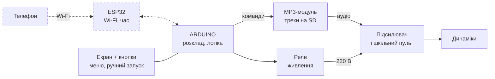
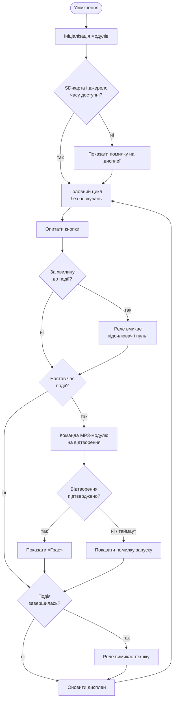

# STEAM-93: шкільний аудіоплеєр за розкладом

Невеликий вбудований аудіоплеєр, який відтворює вибрані MP3-файли у заданий час. Керування — кнопками, стан і розклад — на невеликому дисплеї.

> **Стан проєкту:** початкова ініціалізація. Плата, аудіомодуль, дисплей, джерело точного часу та розводка контактів ще не обрані. Скетч поки є порожньою заготівкою.

## Заплановані можливості

- Відтворення аудіофайлів за розкладом.
- Ручне керування кнопками: навігація, вибір і запуск/зупинка.
- Відображення часу, стану плеєра та, за можливості, наступного відтворення.
- Зберігання аудіофайлів на microSD або у сховищі аудіомодуля — залежно від обраного обладнання.

## Попередня апаратна схема

Архітектура узгоджена з презентацією [`artifacts/STEAM-93 Шкільний аудіоплеєр.md`](artifacts/STEAM-93%20Шкільний%20аудіоплеєр.md).

| Частина | Попередній варіант | Що потрібно вирішити |
| --- | --- | --- |
| Контролер | Arduino — зберігає розклад і керує всім | Точна модель плати та доступні піни |
| ESP32 (опційно) | Wi-Fi: налаштування з телефона та інтернет-час | Чи потрібен взагалі; спосіб зв'язку з Arduino |
| MP3-модуль | Модуль, що грає треки з microSD (напр., DFPlayer Mini) | Модель і спосіб керування |
| Екран + кнопки | Невеликий OLED або LCD, кілька кнопок | Розмір, інтерфейс, кількість і призначення кнопок |
| Реле | Вмикає/вимикає живлення підсилювача й пульта | Модель, струм/напруга комутації, схема захисту |
| Підсилювач і пульт | Уже є в школі | Вхід для аудіосигналу, рівень сигналу |
| Час | RTC-модуль або інтернет-час через ESP32 | Чи потрібен автономний точний час без мережі |

### Блок-схема (попередня)



Пунктир — опційні частини (телефон, ESP32). Інтерфейси між модулями, піни та напруги живлення ще не визначені.

> ⚠️ Усе, що стосується мережі 220 В (реле, підсилювач), підключає або перевіряє дорослий фахівець.

### Логіка роботи (незалежна від обладнання)



Приклад розкладу з презентації: 08:59 — реле вмикає техніку; 09:00 — гімн України і хвилина мовчання; далі — цитата дня; наприкінці — реле вимикає техніку.

Це лише варіанти для обговорення, а не підтверджена сумісність або готова схема. Не підключайте модулі за довільними номерами GPIO: спочатку треба зафіксувати точні моделі плати й компонентів, напруги живлення та розводку.

## Структура репозиторію

```text
.
├── README.md                 # Опис проєкту та поточний план
├── AGENTS.md                 # Інструкції для Codex у цьому репозиторії
├── artifacts/                # Презентація проєкту (Marp і PPTX)
└── controller/
    └── controller.ino        # Початкова заготівка прошивки
```

## План роботи

1. Обрати точну плату, аудіомодуль, дисплей, кнопки та спосіб отримання часу.
2. Скласти схему підключення з урахуванням рівнів напруги й живлення аудіотракту.
3. Визначити формат розкладу та спосіб його налаштування і зберігання.
4. Реалізувати неблокувальну логіку розкладу, керування кнопками та відображення стану.
5. Зібрати й перевірити прошивку для конкретної плати, а потім окремо перевірити роботу на обладнанні.

## Збірка

Поточний `controller/controller.ino` містить лише порожні `setup()` і `loop()`, тому готової прошивки для збирання ще немає. Після вибору плати будуть додані точні інструкції для Arduino IDE або PlatformIO, потрібні бібліотеки та конфігурація.

## Питання для наступного кроку

- Яка саме плата: модель ESP32 чи інша Arduino-сумісна плата?
- Яка модель MP3-модуля, дисплея та RTC (якщо він потрібен) уже є або планується?
- Плеєр має працювати без Wi-Fi? Чи має зберігати час після вимкнення живлення?
- Які потрібні кнопки та скільки подій розкладу має підтримувати пристрій?

До уточнення цих параметрів піни, бібліотеки, напруга живлення й схема підключення залишаються невизначеними.
