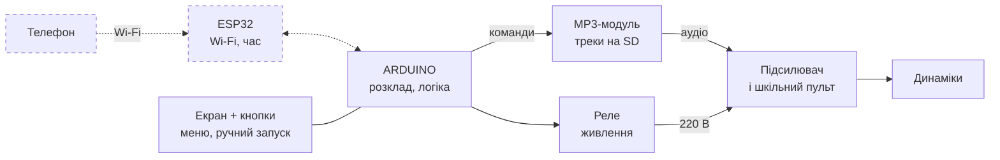

<!-- _class: dark -->
<!-- _paginate: false -->

###### STEAM-93 · учнівський STEM-проєкт

# Шкільний аудіоплеєр за розкладом

Гімн України, хвилина мовчання о 9:00 і цитата дня — автоматично. Зібрано руками учнів.

<!-- Коротко: учні самі збирають пристрій, який щоранку вмикає шкільне озвучення. -->

---

###### Про проєкт

## Що ми робимо

Команда учнів збирає пристрій, який щоранку **сам** вмикає гімн України та хвилину мовчання, а потім — цитату дня.

| Адміністрації | Учням | Усім |
| --- | --- | --- |
| Навіщо це школі та які головні цілі | Які будуть ролі і як усе відбуватиметься | Як улаштований пристрій і як він працює |

---

###### Для адміністрації

## Головні цілі проєкту

1. **Навчити** — базові поняття електроніки та програмування не на папері, а на справжньому пристрої.
2. **Навчити вести проєкт** — учні пробують себе як менеджер, product owner, програміст і відповідають за результат.
3. **Принести реальну користь** — пристрій щодня працює в школі, а не лежить на полиці після виставки.

---

<!-- _class: dark -->

###### Для адміністрації

## Користь для школи

- **Автоматизація о 9:00** — гімн України і хвилина мовчання щодня вчасно, без ручного запуску.
- **Інтерактивний контент** — цитата дня або цікава фраза, маленька традиція, яку чекають.
- **Сучасний імідж** — школа, де технології створюють самі учні, — це трендово.
- **Приклад для інших** — як зібрати команду і зробити STEM-проєкт, що реально допомагає.

---

###### Як це працює

## Схема системи

Пунктир — опційні частини. Точний час: RTC-модуль або інтернет-час через ESP32 — остаточно вирішимо на етапі вибору компонентів.

---

###### Як це працює

## Що використовуємо і навіщо

| Компонент | Що робить | Чого навчимось |
| --- | --- | --- |
| **Arduino** | Зберігає розклад, керує всім | Програмування, логіка |
| **MP3-модуль** | Грає треки з карти microSD | Звук, обмін командами |
| **Екран + кнопки** | Показує стан, дає ручне керування | Інтерфейс користувача |
| **Реле** | Вмикає підсилювач і пульт | Керування живленням, безпека |
| **Підсилювач і пульт** | Вже є в школі — робить звук гучним | Як улаштоване озвучення |
| **ESP32** (опційно) | Wi-Fi: телефон і точний час | Мережі, інтернет речей |

---

<!-- _class: dark -->

###### Як це працює

## Звичайний шкільний ранок

| **08:59** | **09:00** | **Далі** | **Кінець** |
| --- | --- | --- | --- |
| Техніка прокидається: реле вмикає підсилювач і пульт | Гімн і хвилина мовчання — автоматично, щодня вчасно | Цитата дня або цікава фраза для настрою | Тиша: реле вимикає техніку до наступної події |

Час, треки й порядок налаштовуються з екрана — або з телефону, якщо додамо ESP32.

---

###### Для учнів

## Обери свою роль у команді

| Роль | Що робить |
| --- | --- |
| **Менеджер проєкту** | Планує, стежить за строками, збирає команду |
| **Product Owner** | Вирішує, що має вміти пристрій і що важливіше |
| **Програміст** | Пише код для Arduino: розклад, меню, звук |
| **Інженер-електронік** | Збирає схему, паяє, підключає модулі |
| **Тестувальник** | Шукає баги, перевіряє, що все грає вчасно |
| **Контент-автор** | Добирає цитати дня й цікаві фрази |

---

###### Для учнів

## Як це буде відбуватися

1. **Ідея і вимоги** — що має робити пристрій
2. **Вибір деталей** — модулі, бюджет, закупівля
3. **Збірка схеми** — макет, пайка, перевірка
4. **Програмування** — розклад, меню, звук
5. **Тестування** — кілька днів пробного режиму
6. **Запуск у школі** — презентуємо результат

Зустрічі: **[__ раз на тиждень]** · Тривалість: **[__ тижнів]** · Куратор: **[ім’я]**

---

<!-- _class: dark -->

###### Для учнів

## Що ти отримаєш

- **Ази електроніки** — струм, напруга, модулі, реле: як усе з’єднується.
- **Ази програмування** — код для Arduino: змінні, умови, розклад, меню.
- **Досвід справжньої ролі** — менеджер, product owner, програміст, як у реальній ІТ-команді.
- **Результат, який чути** — твій пристрій щоранку звучить на всю школу. І це — у портфоліо.

---

###### Для адміністрації

## Що потрібно від школи

- Доступ до шкільного підсилювача і пульта
- Місце для пристрою та розетка поруч
- Бюджет на компоненти: **[≈ ₴____]**
- Куратор від школи: **[ПІБ]**
- Погодження розкладу і треків

> ⚠️ **Безпека понад усе.** Усе, що стосується мережі 220 В, підключає або перевіряє дорослий фахівець. Учні працюють з безпечною низькою напругою.

---

<!-- _class: dark -->
<!-- _paginate: false -->

# Зробимо школу трохи **розумнішою** — разом

Хочеш у команду? Пиши **[контакт]** або підходь до **[ім’я куратора]**.

###### STEAM-93 · учнівський STEM-проєкт